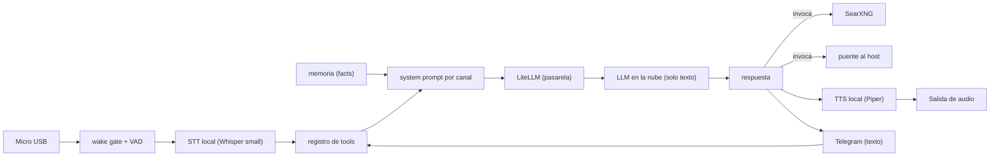

# Arquitectura del sistema

## Visión general: el principio híbrido local-first

El sistema se construye sobre una decisión arquitectónica deliberada: **todo lo que toca al usuario o a sus datos corre en local; solo el razonamiento lingüístico viaja a la nube**. Este principio, denominado *local-first*, no es una postura ideológica sino el resultado de un análisis de costes y latencias. La captura de audio, la detección de la palabra de activación (*wake word*), la transcripción de voz a texto (STT), la síntesis de texto a voz (TTS), la memoria, la visión y la orquestación de herramientas se ejecutan en la propia máquina del hogar. Al exterior solo viaja **texto**: el turno transcrito se envía a un modelo de lenguaje grande (LLM) alojado en la nube y regresa convertido en respuesta. La voz del usuario, por tanto, nunca abandona el equipo.

La justificación del trade-off es doble. Ejecutar un LLM de gran capacidad en local exigiría una GPU dedicada de la que el hardware carece; delegar ese razonamiento a un proveedor externo permite usar un modelo competente sin coste de cómputo propio. A cambio se acepta una dependencia de red y la salida del texto del turno hacia un tercero. Las partes sensibles a la privacidad y a la latencia (el audio crudo, la cara del usuario, la memoria de hechos) se mantienen bajo control directo, mientras que la pieza cara en cómputo (la inferencia del modelo) se externaliza.

## El hardware: un único nodo

El anfitrión es un **Lenovo ThinkCentre M70q Tiny** con un procesador Intel i5-10400T (6 núcleos / 12 hilos, 35 W de TDP), 16 GB de RAM y **sin GPU dedicada**: solo dispone de la iGPU integrada Intel UHD 630. El sistema operativo es Ubuntu Server 24.04 LTS y el repositorio reside en `/opt/jarvis`.

Estas características imponen restricciones claras. La ausencia de GPU descarta la inferencia local de modelos grandes y obliga a la estrategia híbrida descrita. El TDP de 35 W y los 16 GB de RAM acotan cuánto trabajo pesado puede correr de forma simultánea. La consecuencia práctica más visible se da en el STT: el modelo Whisper *medium* resultó inviable en CPU (entre 6 y 7 segundos por segmento), por lo que se adoptó Whisper *small* con afinado específico para español, que rinde en torno a medio segundo.

A la vez, el nodo ofrece oportunidades. Como el razonamiento del LLM se delega a la nube, la CPU local queda mayormente ociosa y puede dedicarse al STT (configurado con 12 hilos). La iGPU UHD 630, infrautilizada, se reserva para la fase de visión mediante OpenVINO, que sabe explotar gráficos integrados Intel. El particionado sigue el principio de **lo caliente en el NVMe M.2**: el sistema operativo, los contenedores Docker y los modelos —que se leen en cada arranque y de forma constante— viven en el disco rápido, mientras que un SSD SATA de 1 TB queda como reserva de capacidad montada en solo lectura para métricas.

## Descomposición en servicios sobre Docker Compose

El sistema entero es **un único proyecto Docker Compose**, con versiones de imagen fijadas y comentadas, y con la filosofía «fases con flags, no ramas»: los servicios de fases futuras ya existen en el repositorio pero permanecen apagados mediante perfiles de Compose o variables de entorno. La superficie de red es mínima: solo el panel (puerto 8080) y n8n (5678) publican puerto, y únicamente en `127.0.0.1`; el resto de servicios se comunican por la red interna de Docker.

| Servicio | Rol | Tecnología |
|---|---|---|
| **orchestrator** | Corazón del sistema: pipeline de voz y agente multicanal | Pipecat sobre Python |
| **litellm** | Pasarela LLM compatible con OpenAI, con alias y *fallbacks* | LiteLLM |
| **searxng** | Metabuscador privado para la herramienta de búsqueda web | SearXNG |
| **chroma** | Almacén vectorial (evaluado para la memoria semántica) | ChromaDB |
| **postgres** | Base de datos de persistencia de n8n | PostgreSQL |
| **n8n** | Motor de acciones por *webhooks* con verificación HMAC | n8n |
| **vision** | Presencia escalonada y captura de fotograma | OpenVINO + iGPU |
| **panel** | Centro de control y HUD | FastAPI + HTMX |
| **socket-proxy** | API de Docker de solo lectura para el panel | docker-socket-proxy |
| **cloudflared** | Túnel saliente para el acceso remoto seguro | Cloudflare Tunnel |

La **pasarela LLM** (LiteLLM) merece atención porque materializa el principio híbrido: expone una interfaz única y compatible con OpenAI hacia el orquestador, de modo que el resto del sistema ignora qué modelo concreto razona detrás. Su alias principal apunta a un modelo de gran capacidad en la nube, con *fallbacks* a proveedores alternativos; cambiar de cerebro es modificar configuración, no código. El **buscador** (SearXNG) ofrece búsqueda web sin claves de API, alineado con el espíritu *self-hosted*. El **panel** nunca habla directamente con el *socket* de Docker, sino a través de un proxy limitado a operaciones de lectura, reduciendo la superficie de privilegio.

## Componentes internos del orquestador

El orquestador dejó de ser un simple bucle de voz para convertirse en un agente multicanal con memoria propia. Todos sus subsistemas conviven dentro del mismo servicio:

- **Pipeline de voz** — cadena Pipecat que encadena *wake gate*, detección de actividad de voz (VAD), STT y TTS. Es el canal de entrada y salida hablado.
- **Agente de texto (Telegram)** — canal de texto bidireccional que dota al sistema de una boca y un oído independientes del micrófono; es un canal de primera clase junto a la voz.
- **Registro de herramientas desacoplado** — catálogo de *tools* definido una sola vez y **compartido por ambos canales**, evitando duplicar definiciones entre voz y texto.
- **Memoria (almacén `facts`)** — memoria propia con *recall* (recuperación de hechos relevantes) y *decay* (los hechos pierden peso con el tiempo si no se refuerzan), alimentada por un proceso **Curator** que aprende hechos a partir de la conversación.
- **Proactividad** — el sistema puede iniciar comunicación sin que se le pregunte, emitiendo avisos por voz o eco a Telegram.
- **Tareas programadas (cron)** — planificador interno al proceso para recordatorios y trabajos recurrentes, sin depender de temporizadores externos.
- **System prompt por canal** — la composición del *prompt* de sistema se adapta al canal, de modo que el mismo cerebro se comporta de forma idónea en un diálogo hablado breve o en un intercambio escrito.

Junto a estos, un **clasificador de errores LLM** categoriza los fallos del modelo (límites de tasa, *timeouts*, errores de contexto) para decidir reintento o *failover* en coordinación con los *fallbacks* de la pasarela.

## El puente al host

Para delegar acciones que requieren acceso directo al sistema de ficheros y al entorno del anfitrión, existe **un servicio fuera de Compose**, ejecutado como unidad systemd en el host, que actúa de puente hacia un agente de codificación más capaz (Claude Code). Ofrece dos capacidades —`investigar` (solo lectura) y `encargar` (ejecución, protegida por un guardia de comandos)— y vive en el host, no en un contenedor, precisamente por esa necesidad de acceso directo. Su funcionamiento se detalla en el capítulo de agencia.

## Flujo de datos de un turno

Un turno completo, de la voz a la respuesta, recorre el siguiente camino: el micrófono captura audio que el *wake gate* vigila; al detectar la palabra de activación, el VAD delimita la locución, el STT la transcribe a texto en local, y ese texto —junto con la memoria recuperada y el *prompt* compuesto para el canal— se envía por la pasarela LiteLLM al LLM en la nube. La respuesta vuelve como texto, puede invocar herramientas (búsqueda, acciones, puente al host) y finalmente el TTS la sintetiza en voz por la salida de audio.

El cableado lógico respeta cuatro invariantes: el orquestador es el único proceso con acceso al audio, igual que el servicio de visión es el único dueño de la cámara (V4L2 es de consumidor único); el panel solo accede a Docker mediante el proxy de lectura; el acceso desde internet existe solo para el panel y solo tras la identificación de Cloudflare Access; y las acciones de alto privilegio cruzan siempre por el guardia de comandos antes de ejecutarse.
