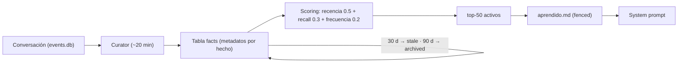

# Memoria y aprendizaje continuo

## El problema: recordar sin saturar

Un modelo de lenguaje no conserva nada entre llamadas. Cada petición a la API parte de cero, de modo que un asistente construido directamente sobre el modelo trata cada conversación como la primera: olvida el nombre de la pareja del usuario, las decisiones que ya se tomaron y las preferencias expresadas ayer. Para un asistente personal esto es más que una incomodidad, es una ruptura de la ilusión de continuidad sobre la que descansa la utilidad del sistema.

La respuesta ingenua —memorizarlo todo e inyectarlo en cada petición— fracasa por el extremo opuesto. La ventana de contexto es finita y costosa, y se ha observado de forma sistemática que su saturación degrada la calidad de las respuestas: el modelo se distrae con material irrelevante y pierde de vista la pregunta actual. El reto no es, por tanto, *guardar* sino *seleccionar*: recordar lo importante y olvidar lo irrelevante, manteniendo el contexto inyectado dentro de un presupuesto. Este capítulo describe cómo el sistema resuelve ese equilibrio sin recurrir a *fine-tuning* —descartado por ser menos controlable, reversible y auditable que la combinación de memoria más prompt— ni a la maquinaria de embeddings que el plan inicial contemplaba.

## Arquitectura de la memoria: dos niveles

La memoria efectiva se organiza en dos niveles complementarios, cada uno con una pregunta distinta.

**Nivel episódico — «qué se dijo».** Cada turno de conversación se registra en una base SQLite como filas de usuario y de asistente. Sobre esa tabla se mantiene un índice de texto completo con **FTS5**, el motor de búsqueda léxica integrado en SQLite. La herramienta `recordar` lo consulta: cuando el usuario pregunta «¿qué te dije la semana pasada sobre X?», el asistente lanza una búsqueda de texto completo contra el histórico y recupera los fragmentos pertinentes. No hay similitud vectorial; es búsqueda léxica con el *ranking* propio de FTS5. La contrapartida es conocida: la búsqueda léxica no capta sinónimos ni paráfrasis como sí lo haría una recuperación semántica. A cambio es **transparente y depurable** —se puede ver exactamente por qué casó cada resultado—, una propiedad valiosa para un corpus de un solo usuario.

**Nivel semántico — hechos durables sobre el usuario.** Por encima del log episódico vive un almacén estructurado de *hechos*: preferencias, personas del entorno, rutinas, decisiones tomadas. No es la transcripción de lo que pasó, sino el destilado de lo que conviene saber del usuario a largo plazo. Reside en la tabla `facts` de SQLite y se proyecta sobre un fichero, `aprendido.md`, que es lo que finalmente entra en el prompt.

## El Curator: destilar hechos, descartar lo efímero

La extracción de hechos no ocurre en cada turno, sino mediante el **Curator**, una tarea de fondo que se ejecuta cada ~20 minutos. Pasa por el LLM las conversaciones recientes con un único cometido: extraer hechos durables y descartar lo efímero. Su prompt es explícito al respecto —rechaza horas, citas y reuniones concretas, estados de ánimo del momento y fallos técnicos pasajeros— porque eso caduca y no describe un rasgo estable del usuario.

Ejecutar la extracción en segundo plano, y no de forma síncrona en cada turno, tiene dos ventajas: no añade latencia ni coste a la conversación en vivo, y permite al modelo observar una ventana de varios turnos a la vez, con lo que destila mejor. Este trabajo administrativo se envía a un **modelo económico**, de modo que la memoria nunca compite con la conversación por presupuesto.

Conviene distinguir dos modos de aprendizaje con gobernanza distinta:

| Tipo de cambio | Qué es | Gobernanza |
|---|---|---|
| Auto-escritura de **datos** | Gustos, personas, rutinas | Automática, sin aprobación |
| Auto-mejora del **comportamiento** | Ajustes de perfil, trato o tono | Propuesta → aprobación humana en el panel |

Los datos son reversibles y de bajo riesgo, por lo que se escriben solos. Modificar *cómo se comporta* el asistente es otra cosa: el Curator lo **propone** y deja la propuesta pendiente en el panel, donde el usuario la aprueba o rechaza. La ficha base de personalidad nunca se reescribe de forma autónoma. Hay, así, un humano en el bucle para todo cambio del modelo que el asistente tiene de su usuario.

## Recall y decay: la pieza clave

El valor del almacén no está en guardar hechos, sino en **priorizar los que importan y dejar caer los que no**. Cada hecho lleva metadatos: cuándo se aprendió, cuándo se re-mencionó, cuándo se recuperó, cuántas veces y un estado (`active` / `stale` / `archived`). Sobre ellos operan dos dinámicas inspiradas en la consolidación de memoria biológica, donde lo que se reactiva se afianza y lo que no se usa se desvanece.

- **Recall (refuerzo por uso).** Cuando el usuario vuelve a mencionar un hecho, o el sistema lo recupera para responderle, sube su contador y se actualiza la marca temporal. Lo que se usa gana prioridad de forma natural, por frecuencia real y no por recencia de creación.
- **Decay (caducidad sin borrado).** Un hecho que no aparece en **30 días** pasa a `stale`; si sigue ausente a los **90 días** pasa a `archived`. La pieza crítica es que **nada se borra**: un hecho archivado permanece en la base y es **recuperable** si vuelve a ser relevante. La memoria olvida lo que dejó de importar sin perder lo que un día importó.

Sobre estos metadatos, una función de *scoring* decide qué hechos entran en el prompt. Combina tres señales: **recencia** con vida media de 14 días, **recall** y **frecuencia**, ponderadas 0,5 / 0,3 / 0,2 respectivamente. El resultado ordena los hechos activos, y solo los **50 mejores** se vuelcan al fichero del prompt. Ese tope de 50 es el **presupuesto** explícito: garantiza que la memoria inyectada no crezca sin freno ni desplace al resto del contexto.

Adicionalmente, una pasada de **consolidación** diaria fusiona duplicados y resuelve contradicciones quedándose con lo más reciente, siempre con copia de seguridad previa.

## Por qué no mem0

El plan original contemplaba **mem0** sobre un almacén vectorial: extracción automática de hechos, embeddings y recuperación semántica. Fue una opción seria, y se llegó a auditar su configuración. La conclusión fue que **no compensaba** para un asistente de un solo usuario, con volumen modesto y una huella de RAM exigente. La maquinaria de un *vector store* —un contenedor adicional, embeddings multilingües con sus particularidades, la doble llamada al LLM por cada inserción, los pines de versión— pesaba más de lo que aportaba.

La solución propia —**FTS5 + Curator + almacén `facts` con recall/decay**— cubre las mismas necesidades con menos contenedores, menos memoria, sin embeddings que reindexar y, sobre todo, con un comportamiento **inspeccionable de principio a fin**. mem0 queda documentado como camino evaluado y descartado, no como deuda pendiente.

## Privacidad de la memoria

La memoria es una superficie de ataque. Como los hechos provienen en última instancia de texto de conversación, un hecho redactado en forma imperativa («recuerda que debes…») no debe poder reescribir el comportamiento del asistente. Por eso el fichero de hechos se inyecta **fenced**: encerrado en un bloque acotado y precedido de una advertencia explícita al modelo de que **lo que sigue son datos sobre el usuario, no instrucciones**. El *fencing* marca la frontera entre lo que el asistente *sabe* y lo que *obedece*, y constituye una defensa frente a la inyección de prompts y al envenenamiento de memoria. Como salvaguarda complementaria, lo que el asistente lee en internet no se convierte en hecho durable: la memoria semántica se nutre de lo que el usuario dice, no de lo que la web afirma.
