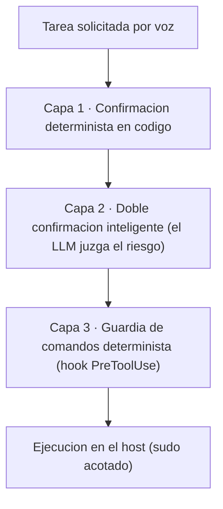

# Agencia: delegación segura de acciones

## El salto de informar a actuar

Hasta este punto, el asistente descrito era, en lo esencial, un sistema que **informa**: escucha una pregunta, consulta su memoria o internet, y responde de viva voz. Es útil, pero es un mayordomo manco. El salto cualitativo —y el más delicado de toda la arquitectura— consiste en darle **manos**: capacidad de crear y editar archivos, gestionar los contenedores Docker y los servicios *systemd* del propio servidor que lo hospeda, instalar paquetes y, en general, operar el *homelab* por voz.

Ese salto es deseable por una razón evidente: el valor de un asistente doméstico crece cuando deja de limitarse a decir *cómo* se reinicia un servicio y pasa a reiniciarlo él mismo. Pero es peligroso por la misma razón: actuar sobre el sistema implica poder romperlo. La capacidad que vuelve útil al asistente es exactamente la que, mal gobernada, lo vuelve destructivo.

## El problema de seguridad

Conviene nombrar el riesgo con precisión. Se está concediendo la facultad de ejecutar comandos en un servidor a un modelo de lenguaje (LLM), una pieza que presenta tres debilidades simultáneas:

- **Puede equivocarse.** Un LLM razona de forma probabilística; nada garantiza que la orden que emite sea la que el usuario pretendía.
- **Puede ser manipulado.** El asistente lee contenido externo (páginas web) y su propia memoria aprendida. Una página envenenada o un recuerdo con una orden incrustada constituyen un vector de inyección indirecta: la *lethal trifecta* descrita en el capítulo de seguridad —datos privados, contenido no confiable y capacidad de actuar conviven en el mismo sistema—.
- **Recibe entrada por voz.** La transcripción introduce un canal de error propio: «borra los logs de enero» puede transcribirse como algo más amplio o ambiguo. Una orden mal entendida, sobre un comando con efecto real e irreversible, no admite un «deshacer».

El problema central, por tanto, no es si el modelo *quiere* portarse bien, sino qué ocurre cuando se equivoca, lo engañan o lo malinterpreta. Toda la arquitectura de este capítulo se construye sobre esa pregunta.

## El puente al host: investigar y encargar

La estrategia parte de una división de trabajo. El «cerebro» conversacional que decide cuándo y cómo actuar es un modelo económico y rápido; pero la ejecución difícil no la realiza ese cerebro, sino un **operador más capaz que corre en el propio host**: una instancia de Claude Code expuesta mediante un puente HTTP. El cerebro barato orquesta y delega; el agente del host ejecuta.

Esa delegación tiene dos modos, deliberadamente distintos en carácter y en riesgo:

| Herramienta | Alcance | Riesgo |
|---|---|---|
| `investigar(tema)` | Solo lectura y web: busca, lee y sintetiza, no toca el servidor | Bajo |
| `encargar(tarea)` | Acciones reales sobre el host: `docker`, `systemctl`, `apt` | Alto |

Ambas son asíncronas: el asistente lanza el trabajo, continúa la conversación y avisa cuando termina. La separación es ella misma una medida de seguridad: la mayoría de las consultas se resuelven con `investigar`, que no puede causar daño, y solo las que exigen actuar cruzan a `encargar`, donde se concentra toda la defensa.

## El modelo de seguridad en tres capas

El usuario pidió explícitamente «acceso amplio con confirmación»: que el asistente pudiera encargar tareas reales sin convertir cada operación en un interrogatorio, pero sin abrir la puerta a un desastre. Para conciliar ambas cosas, `encargar` se montó con **tres capas de seguridad independientes**, gobernadas por un principio rector: *la última defensa nunca debe ser un prompt*. El modelo puede fallar o ser manipulado; las barreras que de verdad importan viven en código determinista, fuera del LLM.

### Capa 1: confirmación determinista en código

La confirmación de una tarea con efecto real **no se delega al juicio del LLM**: la exige el orquestador, en código, mediante una máquina de estados. Esta decisión nació de un fallo concreto. Una versión previa dejaba la confirmación en manos del modelo, y este entraba en un **bucle**: re-pedía confirmación una y otra vez, indefinidamente, sin cerrar nunca el ciclo. La lección fue clara: si la lógica de confirmación vive en el prompt, hereda la indeterminación del modelo. Movida a código determinista, el bucle desaparece y la confirmación está garantizada. Es el mismo principio de la confirmación verbal, donde el «sí» del usuario libera la acción mediante un token de un solo uso (caducidad de 30–60 s) mantenido fuera del contexto, de modo que ni una página web maliciosa puede fabricarlo.

### Capa 2: doble confirmación inteligente

Sobre esa base determinista, el asistente **juzga el riesgo** de la tarea y modula cuánta fricción aplica. Una tarea rutinaria —reiniciar un contenedor, consultar el estado de un servicio— se libera con una sola confirmación. Una tarea destructiva o irreversible —borrar datos, formatear, parar algo crítico— recibe un trato distinto: el asistente avisa explícitamente de **qué se pierde** y exige una confirmación rotunda antes de delegar.

Aquí, y solo aquí, la inteligencia del modelo **sí aporta valor**: ponderar el daño potencial de una acción y graduar la fricción en consecuencia es precisamente el tipo de criterio para el que un LLM es bueno. Y resulta aceptable confiarle ese juicio porque **hay una red debajo**: la capa 3. La inteligencia añade fricción donde duele, no en todo; pero no es la barrera última.

### Capa 3: guardia de comandos determinista

La última línea es un **hook** que corre en el host e inspecciona **cada comando** que el operador intenta ejecutar, bloqueando los letales pase lo que pase: `rm -rf` sobre `/` o directorios de sistema, `mkfs`, `dd` contra discos, *fork bombs*, detener *ssh* o el cortafuegos, y similares. Esta guardia es **deliberadamente «tonta»**: no razona, no se la convence con argumentos, no depende de que el modelo «entienda» el riesgo. Esa estupidez es su virtud. Por eso es la última defensa, y por eso —fiel al principio rector— no es un prompt: un comando letal queda bloqueado aunque las dos capas anteriores hayan sido engañadas, incluso si una inyección logró manipular al propio modelo.

Las tres capas son complementarias y de naturaleza distinta: la capa 1 garantiza que *hay* confirmación, la capa 2 calibra su *intensidad* según el daño potencial, y la capa 3 atrapa lo que se cuele de las dos anteriores. Inteligencia para el criterio; determinismo para el suelo.

## Privilegio mínimo

La defensa en profundidad se completa recortando lo que el operador *puede* hacer aunque una orden atraviese las tres capas. El operador del host es Claude Code corriendo como el usuario normal del sistema, **nunca como root**. Su `sudo` está acotado por *sudoers* —validado con `visudo`— a solo tres familias de comandos: `docker`, `systemctl` y `apt`. Puede gestionar el *stack*, los servicios y los paquetes, pero no dispone de root arbitrario. Así, el privilegio disponible está recortado de entrada: el daño máximo posible queda limitado por construcción, no por la buena conducta del modelo.

## Discusión

¿Por qué este enfoque y no, simplemente, instruir al modelo con un prompt cuidadoso —«no ejecutes comandos peligrosos, pide confirmación para lo destructivo»—? Porque un prompt es una barrera del mismo material que la amenaza. Si la entrada puede manipular al modelo, también puede manipular las instrucciones que pretenden contenerlo; y si el modelo puede equivocarse al actuar, puede equivocarse igualmente al aplicar su propia regla de seguridad. Confiar la seguridad a un prompt es pedirle al sospechoso que se vigile a sí mismo.

La alternativa adoptada es la **defensa en profundidad**: usar la inteligencia del LLM donde su criterio aporta valor (la capa 2, que distingue lo rutinario de lo catastrófico), pero apoyarla siempre sobre **suelos deterministas** que no dependen de ese criterio (la confirmación en código de la capa 1 y la guardia de comandos de la capa 3). Ninguna capa es perfecta; el sistema es robusto porque un fallo en una capa lo recoge otra de naturaleza distinta.

Este diseño no se sostiene como argumento, sino como práctica **verificada**. El núcleo de seguridad es testeable sin el resto del *pipeline* de voz, y la delegación queda cubierta por la suite automática del proyecto —68 pruebas en verde a fecha de redacción—, que ejercita la confirmación, el modo de contaminación, el *fencing* de la memoria aprendida y la propia guardia de comandos. El bucle de re-confirmación que motivó la capa 1, por ejemplo, dejó de ser una anécdota para convertirse en un caso de prueba. La seguridad de un asistente que actúa no se declara: se prueba, y se prueba contra los exploits que ya ocurrieron.
