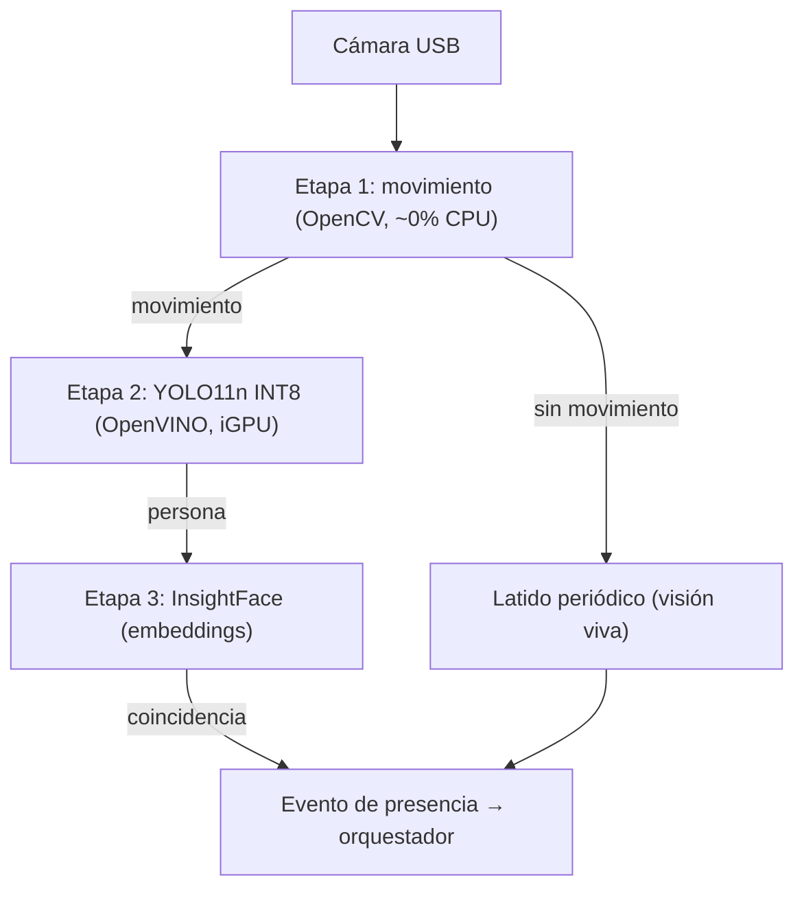

# Visión y presencia

Un asistente que únicamente escucha y responde con voz vive en una sola dimensión sensorial. El paso que acerca al sistema a la metáfora que le da nombre es dotarlo de una segunda capacidad: **saber si hay alguien delante y, a ser posible, quién es**. Esta propiedad, que en el proyecto se denomina *presencia*, no es un fin en sí mismo, sino el insumo que permite al asistente reaccionar de forma adecuada al contexto: saludar a quien llega, elegir el canal por el que comunicarse o describir la escena cuando se le pregunta.

El reto técnico es de eficiencia, no de capacidad. El hardware es un mini-PC de bajo consumo (un procesador de 35 W con la iGPU integrada Intel UHD 630, sin GPU dedicada) que ya sostiene un pipeline de voz en tiempo real. Una red neuronal analizando vídeo de forma continua saturaría la CPU de la que dependen la detección de la palabra de activación y el resto de la cadena de audio. La regla de diseño que hace viable todo el subsistema es, por tanto, una sola: **no ejecutar nunca inferencia continua**.

## El embudo: pipeline escalonado

La solución a esa restricción es un *pipeline escalonado* (un embudo de etapas), donde cada fase es mucho más cara que la anterior y solo se activa ante un resultado positivo de la previa. De este modo, el cómputo costoso se reserva para los instantes en que realmente hace falta.

Las tres etapas son:

1. **Detección de movimiento** (siempre encendida): una simple diferencia entre fotogramas consecutivos con OpenCV. Su coste es prácticamente nulo y actúa como centinela permanente.
2. **Detección de persona** (solo si hubo movimiento): la red **YOLO11n** ejecuta la inferencia para confirmar que el movimiento corresponde a una persona y no a una cortina o una mascota.
3. **Reconocimiento facial** (solo si hubo persona): **InsightFace** intenta poner nombre a la cara detectada.

Cada etapa filtra a la siguiente. La mayor parte del tiempo el sistema solo paga el coste de la etapa 1; las etapas 2 y 3, costosas, permanecen inactivas salvo en los breves momentos de actividad real.

## Tecnología: YOLO11n sobre OpenVINO e InsightFace

La detección de personas usa **YOLO11n**, la variante *nano* (la más ligera) de la familia de detectores de objetos de Ultralytics. El modelo se exporta y **cuantiza a INT8** —es decir, sus pesos se representan con enteros de 8 bits en lugar de números en coma flotante, lo que reduce el tamaño y acelera la inferencia a costa de una precisión ligeramente menor— y se ejecuta mediante **OpenVINO**, el motor de inferencia de Intel que permite aprovechar la iGPU UHD 630 en lugar de la CPU. Con entrada de 320 píxeles, el presupuesto estimado es de unos 25–35 ms por inferencia a dos fotogramas por segundo.

El reconocimiento facial recae en **InsightFace** con el pack de modelos `buffalo_sc`, que combina un detector de caras y un extractor de *embeddings*. Un *embedding* es un vector numérico que codifica los rasgos de una cara: dos imágenes de la misma persona producen vectores próximos entre sí. El reconocimiento se ejecuta en CPU de forma esporádica, ya que se aplica a un único fotograma.

## Distinguir al dueño

La pregunta que responde InsightFace no es solo «¿hay una cara?», sino «¿de quién es?». El sistema mantiene, para cada una de las 1–3 personas de la casa, un *embedding* promedio calculado durante el **enrolado**, un proceso deliberadamente artesanal: bastan entre cinco y diez fotografías frontales con buena luz. Ante una cara nueva, se calcula la **similitud coseno** entre su *embedding* y los almacenados; si supera un **umbral** orientativo (en torno a 0,45–0,5, que deberá calibrarse con la cámara real), se considera una coincidencia.

Conviene precisar el propósito de esta capacidad. Distinguir al dueño sirve para la **personalización** —saludar por el nombre, adaptar el tono, decidir el canal— y **no** se concibe como mecanismo de seguridad fuerte. El reconocimiento facial es engañable y opera con umbrales probabilísticos; usarlo como puerta de acceso sería frágil. Aquí es un afinador de la experiencia, no un guardián.

## Integración con la presencia

La visión no emite hechos aislados («acabo de ver a alguien»), sino que alimenta un **estado de presencia continuo** que el orquestador mantiene con un tiempo de vida (TTL): mientras llegan detecciones, el usuario está *presente*; si el TTL expira, pasa a *ausente*. Sobre ese estado el orquestador decide **por dónde hablar**, como se detalla en el capítulo de proactividad.

La clave que da robustez al diseño es el **latido** (*heartbeat*): aunque no vea a nadie, el servicio de visión emite una señal periódica que significa «estoy vivo, pero no detecto a nadie». Esto permite **distinguir la ausencia real de una caída del subsistema**: silencio de detecciones con latido presente significa «casa vacía»; silencio total significa «avería». Esa distinción habilita el *fail-safe*: ante la duda —sin cámara o con la visión caída— el sistema asume **PRESENTE** y responde por voz, su comportamiento de toda la vida, de modo que un fallo del subsistema nunca deja mudo al asistente.

## Estado real y honestidad sobre las cifras

El subsistema vive partido en dos mitades de madurez distinta. El **servicio de visión está construido por completo** y sus modelos verificados como presentes en el repositorio, pero permanece **apagado**, sin ninguna cara enrolada, a la espera de una sola cosa: la **cámara USB física** dedicada. El bloqueo es enteramente material; el camino de encendido es corto (enchufar, enrolar, cambiar el flag).

Esta honestidad alcanza también a los números. Las cifras de rendimiento de YOLO sobre la iGPU (los 25–35 ms citados) son **estimaciones de diseño, no mediciones en operación**: ningún fotograma real ha atravesado todavía el pipeline en el hardware definitivo. Solo el enchufado de la cámara permitirá sustituir esas estimaciones por medidas y calibrar el umbral de similitud con datos reales.

## Privacidad

El diseño asume un principio firme: **todo el procesamiento de imagen es local**. La detección de movimiento, YOLO e InsightFace se ejecutan dentro de la máquina de casa, y ninguna imagen se envía a la nube de forma rutinaria. La única excepción es explícita y bajo petición del usuario (la consulta puntual «¿qué ves?»), nunca un flujo continuo.

Por último, una asunción física limita el alcance: las webcams USB convencionales **no ven en la oscuridad**, pues carecen de iluminación infrarroja. El sistema lo da por sentado: en penumbra la etapa de visión simplemente no detecta, y el *fail-safe* descrito —asumir presencia ante la falta de señal— evita que esa ceguera nocturna degrade el comportamiento del asistente.
